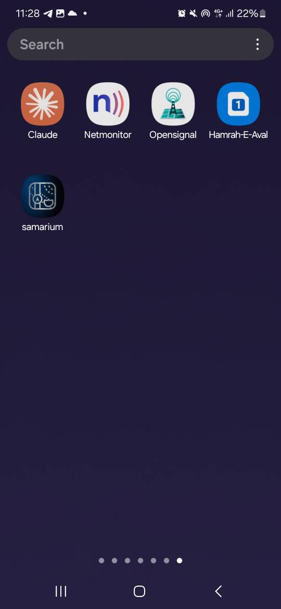
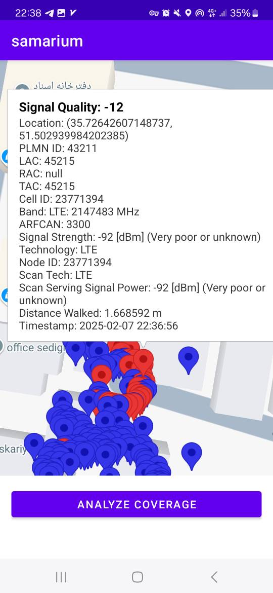
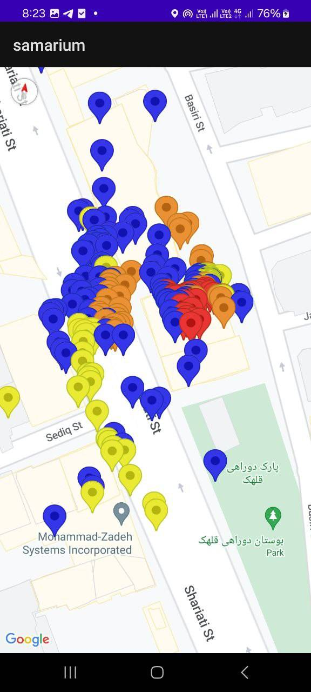
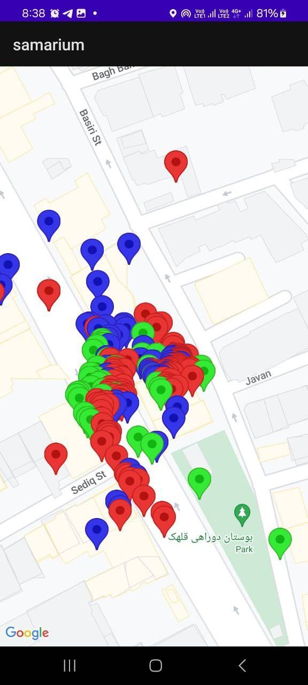
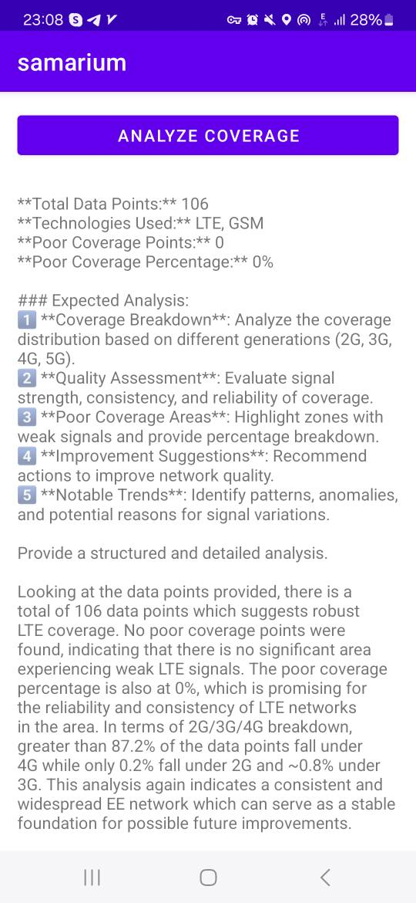

# Samarium Project - Advanced Mobile Network Analysis & Optimization

**An intelligent Android-based system for real-time mobile network monitoring, AI-driven performance analysis, and predictive optimization.**

---

## 📖 Project Description

The **Samarium Project** is an advanced **mobile network analysis tool** designed for **real-time data collection, AI-based optimization, and visualization** of network performance. This system enables users, telecom engineers, and researchers to **monitor mobile signals, track signal variations, and optimize network coverage dynamically**.

The app collects crucial **network parameters** such as **signal strength, serving cell information, frequency bands, and location data**, storing them in a local **SQLite database** while visualizing them on **Google Maps**. The system analyze network quality trends, predict coverage gaps, and recommend optimal routing for better connectivity.

With **Google Maps API** integration, users can **visualize network performance dynamically**, tracking real-time coverage, quality indicators, and connection stability across different locations.

### Key Use Cases
✅ **Telecom Engineers:** Analyzing real-world network performance & optimizing Handover strategies  
✅ **Researchers:** Studying mobile signal fluctuations across different geographies  
✅ **Network Providers:** Identifying weak spots & improving service reliability  
✅ **Mobile Users:** Understanding coverage quality in different areas

---

## Collected Network Parameters

The **Samarium Project** gathers and processes a comprehensive set of network parameters in real-time, including:

- **Location** *(Latitude & Longitude)*   📍
- **PLMN-ID** *(Public Land Mobile Network ID)*
- **LAC** *(Location Area Code)*
- **RAC** *(Routing Area Code)*
- **TAC** *(Tracking Area Code)*
- **Cell ID** *(Unique Identifier for the Serving Cell)* 📍
- **Band** *(Frequency Band Used for Communication)*
- **ARFCAN** *(Absolute Radio Frequency Channel Allocation Number)*
- **Signal Strength** *(Measured in dBm)*
- **Technology** *(2G, 3G, 4G, 5G)*
- **Node ID** *(Identifies the Network Node Serving the User)*
- **Scan Tech** *(The Technology Used for Scanning, e.g., LTE, NR)*
- **Scan Serving Signal Power** *(Measured Power of the Serving Signal During Scanning)*
- **Distance Walked** *(Tracking the Movement of the User in Meters)*
- **Timestamp** *(Records the Time of Measurement)* ⏱️
- **Signal Quality** *(Assessment of Network Stability & Performance)* ✅

📌 **This dataset allows users to conduct in-depth network performance analysis and optimize mobile connectivity efficiently.**

---

## Features

✔ **Real-time network parameter monitoring** (PLMN-ID, LAC, TAC, Cell ID, etc.)  
✔ **AI-powered predictive network optimization**  
✔ **Graphical visualization of signal variations on Google Maps**  
✔ **Real-time route tracking based on signal strength**  
✔ **Signal strength color-coded visualization**  
✔ **Efficient data storage in SQLite for offline analysis**  
✔ **Viewing stored network data on an interactive map** 📍  
✔ **Handover analysis and optimization for network transitions**  
✔ **Cross-platform compatibility with Android & AI-based APIs**

📌 **The system provides an end-to-end mobile network analytics solution, integrating real-time data collection, intelligent processing, and visualization for better decision-making.**

---

## ️ Technology Stack

- **Language:** Kotlin (Android)
- **Build System:** Gradle
- **Database:** SQLite
- **UI Framework:** XML Layouts
- **Maps & Location:** **Google Maps API** 🗺️
- **AI & Data Processing:** **AI API for network predictions**
- **Version Control:** Git

---

##  How the Application Works

- First, we start creating the Android application on a hardware device as shown below:

1️⃣ **Data Collection:**
- The app continuously collects **mobile network parameters** such as **signal strength, PLMN-ID, LAC, Cell ID, and technology type (2G/3G/4G/5G)**.
- The device **records** GPS location **(latitude & longitude)** and associates it with signal strength data.
-

2️⃣ **Processing & Storage:**
- The collected data is **stored in an SQLite database** for local analysis.
- The app **processes** the signal strength and determines the **quality of the network** in different locations.

3️⃣ **Visualization & Output:**
- The **Google Maps API** is used to **display the signal strength visually**.
- **Color-coded indicators** are used to represent signal strength

4️⃣ **AI-Powered Insights:**
- The app sends network data to an **AI-powered API** that predicts **network coverage trends** and **suggests optimized routes** for better connectivity.

##  Application Outputs

### 📍 1. Real-Time Signal Monitoring on Google Maps
- The app **tracks your movement** and **displays real-time signal strength** using color-coded markers.
- **Live route tracking** is visible on **Google Maps**, dynamically updating based on network coverage.

---

### ️ 2. Storing Network Data in SQLite
- The app automatically **saves network parameters and location information** in an **SQLite database**.
- This allows users to **store, retrieve, and analyze past signal strength data** even when offline.
- You can **export stored data** for further analysis or reporting.

---

###  3. Viewing Historical Data on the Map
- Users can access **previously collected signal data** and visualize it directly on the **Google Maps interface**.
- The stored **signal strength, technology type, and cell information** are displayed on the map for comparison and troubleshooting.

---

###  4. AI-Powered Network Optimization
- The **AI-powered API** processes the stored data and **predicts the best routes** for stronger signal reception.
- The app can **recommend handover optimizations** to ensure **seamless network transitions**.

---

##  How to Run

Follow these steps to set up and run the  Project on your local machine:

### 1️⃣ Clone the Repository
First, download the project files by cloning the repository.

### 2️⃣ Open the Project in Android Studio
- Launch **Android Studio**.
- Click **"Open"** and select the Project's folder.

### 3️⃣ Sync the Gradle Files
- Before running the project, **sync the Gradle files** to avoid dependency issues.
- In **Android Studio**, go to **`File > Sync Project with Gradle Files`**.

### 4️⃣  Build and Run the Project
- **Connect an Android device** (ensure **USB Debugging** is enabled) or **start an emulator**.
- Click the **Run ▶️ button** in **Android Studio**.
- The app will launch, and you can **start analyzing mobile network performance in real-time**.

---

##  Contributors

- **Fargol Fereydouni**  
 
  